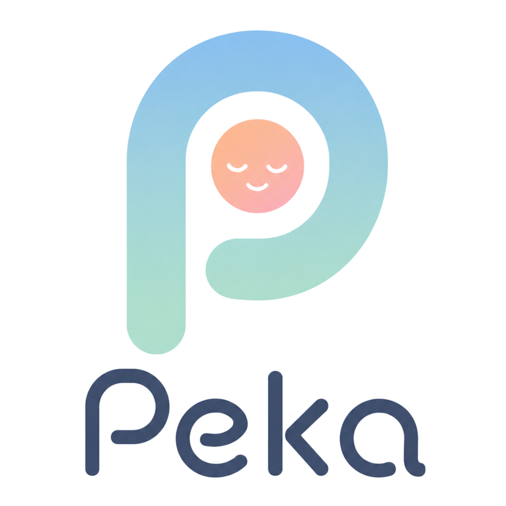

<div align="center">
  
  <h1>Peka</h1>
  <p><strong>Pahami Perasaanmu, Karena Setiap Mood Itu Penting.</strong></p>
  <p><em>Proyek Submit — Top 99 IndonesiaNEXT (10th Batch)</em></p>
</div>

---

## 📌 Apa itu Peka?
**Peka** adalah aplikasi *self-awareness* harian berbasis kecerdasan buatan (AI) yang dirancang untuk membantu Gen Z melacak perubahan suasana hati (mood) dengan sangat cepat (< 1 menit). 

Berbeda dengan aplikasi *self-help* yang memberikan saran generik (seperti "coba tarik napas"), Peka menggunakan **Context-Aware AI** (diotaki oleh Google Gemini) untuk memberikan *micro-intervention* yang sangat personal, berempati, dan relevan dengan kronologi emosimu sepanjang hari.

## ✨ Fitur Utama
- **Mood Check-in Super Cepat:** Antarmuka visual yang modern untuk mencatat mood dan alasan singkat (trigger).
- **Context-Aware AI:** AI tidak hanya merespons inputmu saat ini, tapi membaca riwayat perjalanan emosimu *hari ini* (contoh: pagi lelah, siang marah, sore sedih) agar responnya lebih hangat dan menyentuh bak manusia.
- **Privacy-First:** Wajib menyetujui Kebijakan Privasi di awal. Data dikirim ke AI secara anonim secara *on-the-fly* dan tidak dijual.
- **Dashboard Riwayat & Analitik:** Grafik interaktif (distribusi mood), filter waktu, dan pelacakan *streak* check-in.
- **Shareable Recap Cards:** Hasilkan kartu grafis (PNG) berisi ringkasan mood mingguanmu untuk dibagikan ke Instagram Story.
- **Automated Email Reminders:** Pengingat otomatis via email (dibangun menggunakan Supabase Edge Functions & Resend).
- **UI/UX Elegan:** Transisi halus menggunakan Framer Motion.

## 🛠️ Tech Stack
- **Frontend:** React + Vite, Tailwind CSS, Framer Motion, HTML-to-Image
- **Backend & Auth:** Supabase (Database, Auth, Edge Functions)
- **AI Engine:** Google Gemini API (`gemini-flash-latest`)
- **Email Service:** Resend API
- **Deployment:** Vercel (Frontend), Supabase (Backend)

## 🚀 Cara Menjalankan di Lokal (Local Setup)

1. **Clone repositori ini:**
   ```bash
   git clone https://github.com/akbaralfaidah/peka.git
   cd peka
   ```

2. **Install dependensi:**
   ```bash
   npm install
   ```

3. **Atur Environment Variables:**
   Buat file `.env` di folder *root* dan masukkan kredensial berikut:
   ```env
   VITE_SUPABASE_URL=your_supabase_url
   VITE_SUPABASE_ANON_KEY=your_supabase_anon_key
   VITE_GEMINI_API_KEY=your_gemini_api_key
   ```

4. **Jalankan *development server*:**
   ```bash
   npm run dev
   ```
   Aplikasi akan berjalan di `http://localhost:5173`.

## 📜 Disclaimer Etis
Aplikasi ini adalah alat bantu *self-awareness* harian, **bukan pengganti terapi atau diagnosis profesional**. Jika Anda membutuhkan dukungan psikologis klinis, harap hubungi profesional kesehatan mental.

---
*Dibuat dalam kerangka waktu Hackathon 24 Jam.*
